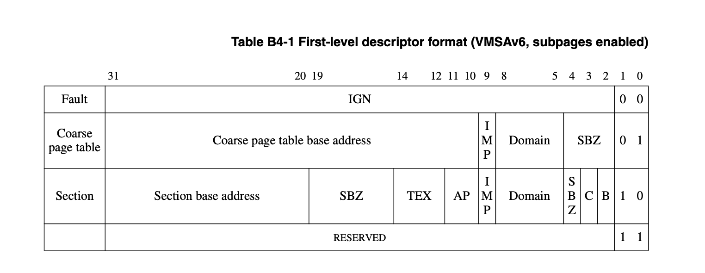
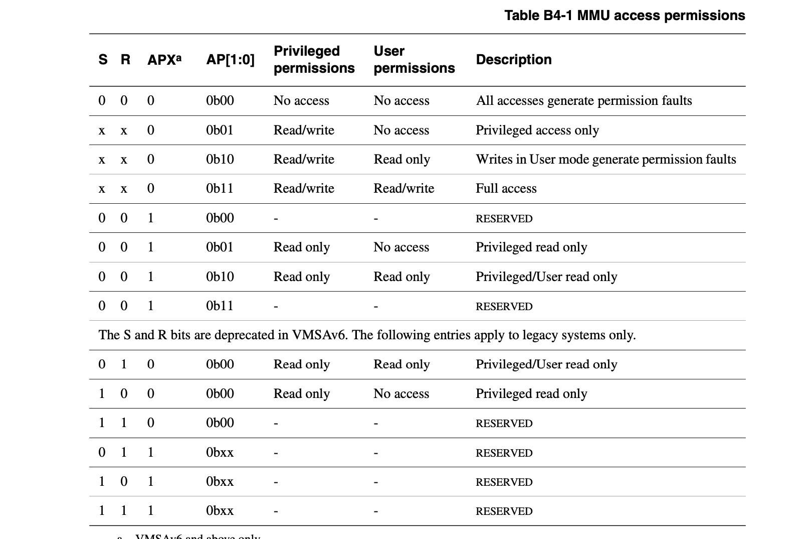

# 移植适配

## 芯片和cpu型号

1、arm

ARM7：ARMv4架构
ARM9：ARMv5架构
ARM11：ARMv6架构
ARM-Cortex 系列：ARMv7架构

ARM7 无MMU
ARM9、ARM11，带有MMU


### F1C100s & F1C200s

CPU: ARM926EJ-S (ARMv5TE) @ 533MHz ARM9
L1 Cache: 16KB Data, 32KB Instruction
FPU: None
GPU: Custom 2D-only
VPU: Unknown

### raspi2

Pi2 的 处理器芯片 BCM2836
CPU: quad-core ARM Cortex-A7 CPU @900MHz


## versatilepb

CPU: ARM Versatile/PB (ARM926EJ-S)  ARMV5T

## versatileab

ARM Versatile/AB (ARM926EJ-S)


### v3s

荔枝派

CPU: ARM CortexTM-A7 CPU @1.2GHz 单核


### miyoo

CPU: SoC – SigmaStar SSD202D 双核 Cortex-A7 处理器 @ 1.2 GHz
GPU: 配备2D GPU，128MB DDR3（注意：无 GPU）


### esp32

版本：ESP32-D0WDQ6 v1
CPU: Xtensa® 32-bit LX6 双核处理器

• 448 KB ROM
• 520 KB SRAM
• 16 KB RTC SRAM


## X86 移植


## ARMV5 移植

资料参考DDI01001.pdf官方文件。

### mmu分页

使用两级，页4k大小

1、level1

使用coarse page table




2、level2

使用small page


s r 是cp15 Register 1: Control register

s是第8位 ，R是第9位




## ARMV6 移植

CP15 控制寄存器 c1中的bit23 0 ARMv5，1 为ARMv6 
(CP15 register 1 XP = 0), the page table formats are backwards compatible with ARMv4/v5:

subpage AP bits are disabled (CP15 register 1 XP = 1), the page tables have support for ARMv6 MMU features

1、level1


2、level2


## ARMV7-A Cortext-a7 移植

移植适配资料请参考DDI0406C_d_armv7ar_arm.pdf官方文件。

### 几个重要的寄存器

堆栈，r13(sp)每个模式都有各自独立的堆栈，
链接，r14(lr)保存跳转前返回的地址，每个模式下都有各自的lr，bl、bx时候会把pc+4 地址给到lr。


根据文档 B1.8.3 Overview of exception entry章节

异常模式时候，异常模式的r14用来保存异常返回地址。


pl1 模式就是特权模式（FIQ、IRQ，Abort 、svc，und，system），pl0是用户权限，pl2是hyp模式。所以如下图，irq中，lr保存的地址为pc+4


IRQ异常时候流程，参考B1.9.10 IRQ exception的Pseudocode description of taking the IRQ exception。
异常时候，保存cpsr值到spsr，同时在arm下lr存的地址，为异常时候的pc-4。修改cpsr的m标志为irq模式。最后，跳转到向量地址运行异常程序。


ldm{cond}  mode  rn{!}, reglist{^}
stm{cond} mode  rn{!}, reglist{^}

^  : 如果reglist有pc寄存器，它表示指令执行后，spsr寄存器的值将自动复制到cpsr寄存器


根据文档，cortex-a7不会像x86一样自动push到堆栈，所以保存上下文，需要自己处理，定义上下文结构：

```
// manual push
u32 no;
u32 code;

u32 psr;
u32 pc;  // return to user addr

u32 r0;
u32 r1;
u32 r2;
u32 r3;
u32 r4;
u32 r5;
u32 r6;
u32 r7;
u32 r8;
u32 r9;
u32 r10;
u32 r11;  // fp
u32 r12;  // ip
u32 sp;   // r13 user sp
u32 lr;   // r14 user lr
```

压入堆栈操作，保存切换的上下文

```c
#define interrupt_entering_code(VEC, CODE) \
  asm volatile(                            \
      "stmfd sp, {r0-r12,sp,lr}^\n"        \
      "subs sp,sp,#60\n"                   \
      "mrs r0,spsr\n"                      \
      "stmfd sp!, {r0,lr} \n"              \
      "mov r1,%0\n"                        \
      "mov r2,%1\n"                        \
      "stmfd sp!, {r1,r2} \n"              \
      "mov r0,sp\n"                        \
      :                                    \
      : "i"(VEC), "i"(CODE))
```

恢复上下文操作。

```c
#define interrupt_exit_context(duck_context) \
  asm volatile(                              \
      "ldr sp,%0 \n"                         \
      "ldmfd sp!,{r1,r2}\n"                  \
      "ldmfd sp!,{r0,lr}\n"                  \
      "msr spsr,r0\n"                        \
      "ldmfd sp,{r0-r12,sp,lr}^\n"           \
      "add sp,sp,#60\n"                      \
      "subs pc,lr,#4\n"                      \
      :                                      \
      : "m"(duck_context->ksp))
```


### mmu

1、level1


2、level2


## RISC-V 移植


## xtensa lx6 移植

移植适配资料请参考Xtensa_lx Overview handbook.pdf，Xtensa® Instruction Set Architecture (ISA)官方文档。

xtensa lx6 不支持mmu，所以，只需要移植context和中断就可以了。


### 几个重要的寄存器

PC 程序计数器寄存器
PS Processor state状态寄存器
AR address registers ar0-ar63
EPC1 Exception program counter2 ,RFE

### 指令

WSR：写特殊寄存器

wsr a0,epc1
wsr a0,ps 

WSR.* at：
WSR at, *：
WSR at, 0-255：

RSR：读特殊寄存器

RSR.* at：
RSR at, *：
RSR at, 0-255：

RFE
  PS.EXCM ← 0
  nextPC ← EPC[1]

